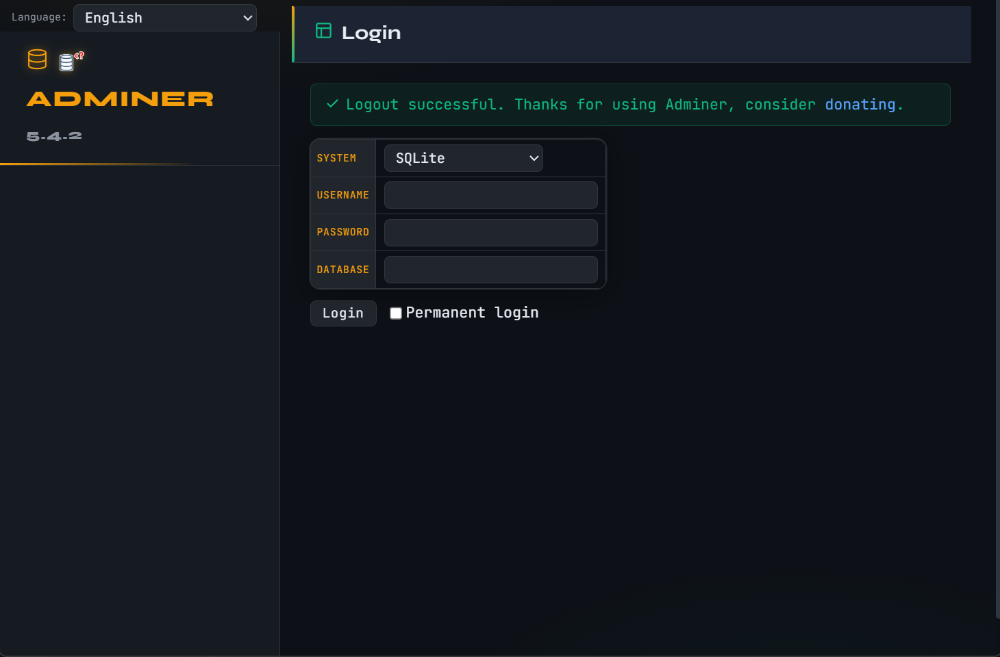
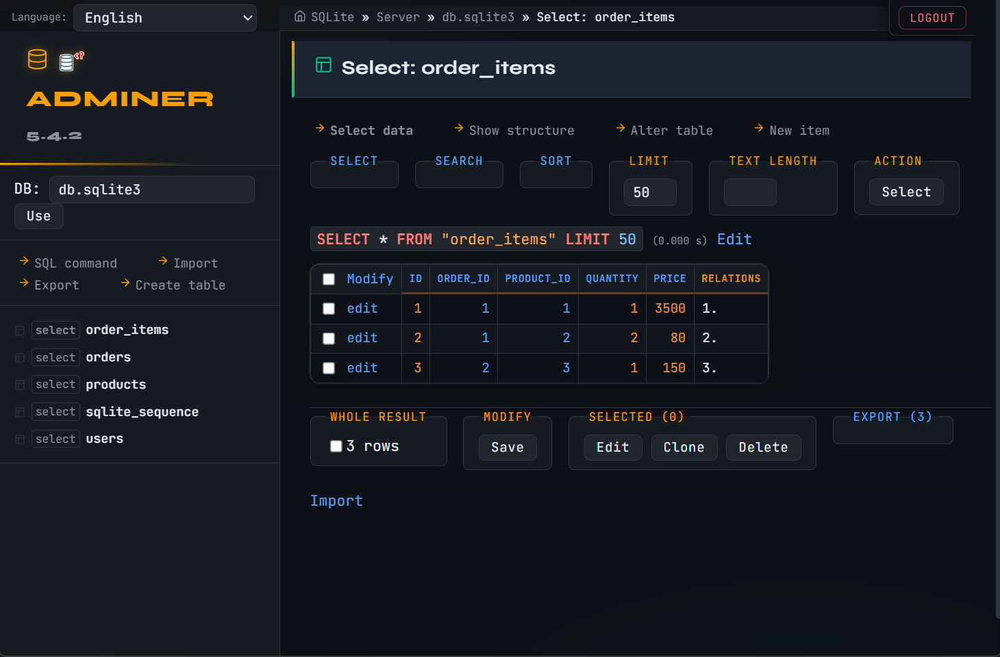
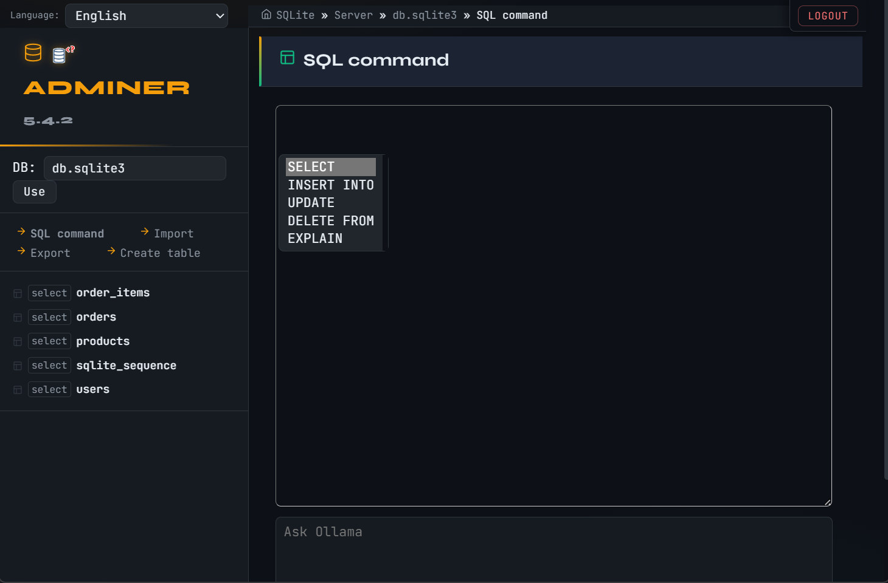
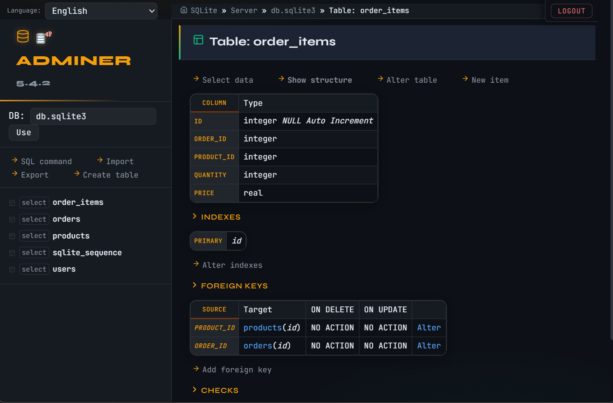

<div align="center">

# 🟠 Obsidian Amber
### A refined dark theme for [Adminer](https://www.adminer.org/)

[](LICENSE)
[](https://www.adminer.org/)
[](#)
[](https://guisaldanha.com)

</div>

---

## ✨ Overview

**Obsidian Amber** is a dark theme for Adminer with a futuristic terminal aesthetic. It combines the deep Obsidian background with golden amber and emerald accents, premium monospace typography, and inline SVG icons — all in a single CSS file, with no external dependencies except Google Fonts.

## Preview






### Color Palette

| Role | Color | Hex |
|------|-------|-----|
| Main background |  Obsidian | `#0d1117` |
| Secondary background |  Obsidian 2 | `#161b22` |
| Primary accent |  Amber | `#f59e0b` |
| Secondary accent |  Emerald | `#10b981` |
| Main text |  Ice | `#e6edf3` |
| Error / Highlight |  Coral | `#f87171` |

### Typography

- **Body:** [JetBrains Mono](https://fonts.google.com/specimen/JetBrains+Mono) — premium monospace for data readability
- **Headings:** [Syne](https://fonts.google.com/specimen/Syne) — modern geometric display

---

## 🚀 Installation

### 1. Download the file

```bash
curl -o adminer.css https://raw.githubusercontent.com/guisaldanha/adminer-obsidian-amber/main/adminer.css
```

Or clone the repository:

```bash
git clone https://github.com/guisaldanha/adminer-obsidian-amber.git
```

### 2. Place it in the same directory as Adminer

```
your-project/
├── adminer-5.x.x.php   ← Adminer file
└── adminer.css         ← Obsidian Amber theme ✅
```

### 3. Done!

Adminer automatically detects any `adminer.css` file in the same folder and applies it. No additional configuration is needed.

---

## 📦 What's Included

| Feature | Detail |
|---------|--------|
| 🎨 Full dark theme | All 133 Adminer selectors styled |
| 🖼️ Inline SVG icons | `icon-up`, `icon-down`, `icon-plus`, `icon-cross`, `icon-move` and more |
| 🌈 Syntax highlighting | Obsidian color scheme for JUSH (SQL, PHP, HTML, JS, CSS) |
| 📱 Responsive | Mobile-adapted with `@media (max-width: 800px)` |
| 🖨️ Print-friendly | Print-specific styles in `@media print` |
| ↔️ RTL support | Compatible with right-to-left layouts |
| 🔤 Google Fonts | JetBrains Mono + Syne (requires internet connection) |
| 🖱️ Smart menu | Long table names expand individually on hover |

---

## ⚙️ Offline Usage (local fonts)

By default, the theme loads fonts via Google Fonts. For 100% offline use:

1. Download the fonts:
   - [JetBrains Mono](https://fonts.google.com/specimen/JetBrains+Mono)
   - [Syne](https://fonts.google.com/specimen/Syne)

2. Place the `.woff2` files in a `fonts/` folder next to `adminer.css`

3. Replace the `@import` at the top of the CSS:

```css
/* Remove this line: */
@import url('https://fonts.googleapis.com/css2?family=JetBrains+Mono...');

/* Add these: */
@font-face {
    font-family: 'JetBrains Mono';
    src: url('fonts/JetBrainsMono-Regular.woff2') format('woff2');
    font-weight: 400;
}
@font-face {
    font-family: 'Syne';
    src: url('fonts/Syne-Regular.woff2') format('woff2');
    font-weight: 400;
}
/* ... other weights as needed */
```

---

## 🔧 Customization

All colors and variables are at the top of the file in the `:root` / `html` section. To change the main accent from amber to another color, just edit the variables:

```css
html {
    --amber:     #f59e0b;   /* main highlight color */
    --amber-dim: #78350f;   /* dark version of highlight */
    --emerald:   #10b981;   /* secondary highlight color */
}
```

---

## 🧪 Compatibility

| Adminer | Compatible |
|---------|------------|
| 5.x     | ✅ Tested  |
| 4.x     | ✅ Should work |
| 3.x     | ⚠️ Not tested |

| Database | Compatible |
|----------|------------|
| MySQL / MariaDB | ✅ |
| PostgreSQL | ✅ |
| SQLite | ✅ |
| MS SQL Server | ✅ |
| Oracle | ✅ |

---

## 📄 License

Distributed under the **MIT** license. See the [LICENSE](LICENSE) file for more details.

```
MIT License — Copyright (c) 2026 Guilherme Saldanha
```

------------------------------------------------------------------------

## 🔗 Related Adminer Projects

### 🖥️ Adminer Launcher

Standalone desktop application that runs Adminer locally with an embedded PHP server and a native PyWebView interface.\
https://github.com/guisaldanha/adminer-launcher

### 🤖 SQL Ollama

Adminer plugin that integrates Ollama to generate SQL queries using local AI models.\
https://github.com/guisaldanha/sql-ollama

### 🎨 Adminer Obsidian Amber

Custom dark theme for Adminer inspired by the Obsidian interface with amber accents.\
https://github.com/guisaldanha/adminer-obsidian-amber

------------------------------------------------------------------------

## 👨‍💻 Author

Developed by **Guilherme Saldanha**
- GitHub: [https://github.com/guisaldanha](https://github.com/guisaldanha)
- Site: [https://guisaldanha.com](https://guisaldanha.com)

------------------------------------------------------------------------

# ❤️ Support the Developer

If this project saves you time or helps your workflow, consider supporting its development.

Ways to help:

- ⭐ Star the repository
- 🔁 Share with other developers
- ☕ Buy me a coffee by [clicking here (PayPal)](https://www.paypal.com/cgi-bin/webscr?cmd=_xclick&business=guisaldanha@gmail.com&item_name=Buy%20a%20coffee%20because%20Adminer%20Obsidian%20Amber%20theme)

------------------------------------------------------------------------
<div align="center">
  <p>Made with ☕ by Guilherme Saldanha</p>
</div>
